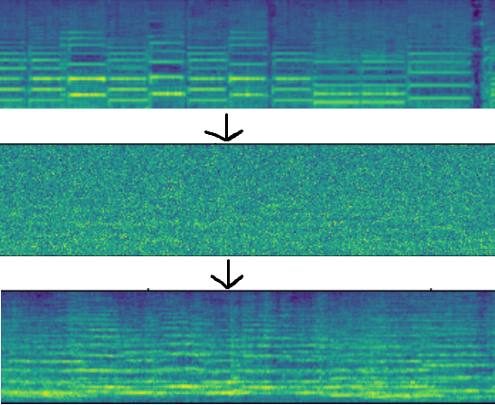

## Realtime audio style morphing
### Demo: https://youtu.be/ITWyPSnuDxw
This approach can make an electric guitar sound like any instrument, and it doesn't require any guitar recordings for training because it's trained with simple denoising objective.
To speed up inference and reduce the latency it uses a custom causal HiFi-GAN implementation as a vocoder and a U-Net with a GRU in the middle for one-step rectified flow. Making it all fast enough to be enjoyable to play with was a challenge. It's still not as fast as I would like it to be, I don't believe python is the right tool for something so time-constrained anyway.

You can test it by running realtime.py, but be warned that it likely won't run fast enough on most setups due to python overhead, it barely runs on mine, and it's quite high-end.
Model trained on violin (though it sounds like cello): https://drive.google.com/file/d/1IsvqeIeCVLJosZ03n6QaDLETReSLfP2e put it in the project's directory

Neat diagram of the process: clean guitar spectrogram -> 75% interpolated with noise -> "reconstructed" violin. Each chunk gets served individually and the convolutions use caching.

